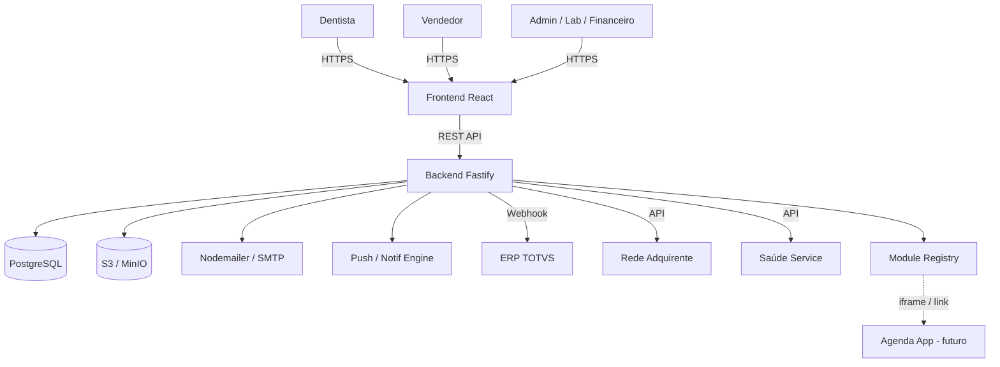
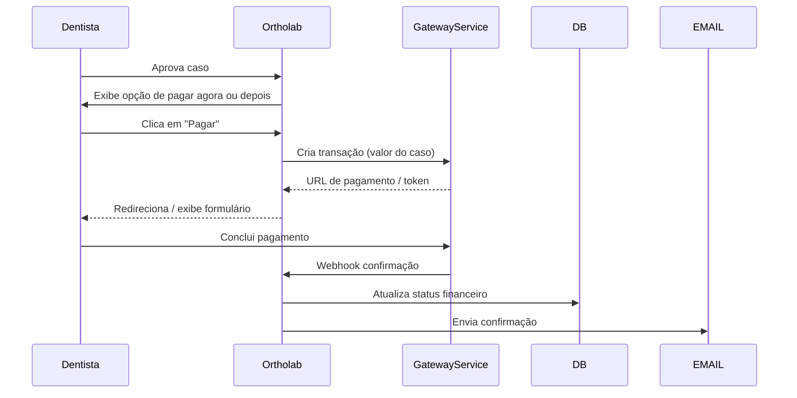

## Objetivo

Portal Ortholab completo, extensível, com fluxo de e-mails em todos os eventos, pagamento integrado, perfil de vendedor com carteira de clientes, push notifications administrativo e arquitetura modular para crescer com novos produtos (agenda, etc).

---

## Stack (sem alterações)

| Camada | Tecnologia |
|---|---|
| Frontend | React 18 + TypeScript + Vite + Tailwind CSS + shadcn/ui |
| Estado / Cache | TanStack Query + Zustand |
| Backend | Node.js + Fastify + TypeScript |
| ORM | Prisma |
| Banco | PostgreSQL |
| Arquivos | AWS S3 / MinIO |
| Auth | JWT (access 15min + refresh 7d) |
| Email | Nodemailer + templates HTML branded EA |
| Excel Export | ExcelJS |
| Pagamentos | Rede (adquirente) + Saúde Service (health-specific) |
| Deploy | Docker Compose |

---

## Roles do Sistema (atualizado)

| Role | Acesso |
|---|---|
| `DENTIST` | Cria casos, envia docs, aprova, paga, solicita refinamento |
| `LAB_TECH` | Planejamento, atualiza status, setup |
| `ADMIN` | Acesso total + push + regras + serviços + preços |
| `FINANCIAL` | Casos aprovados, faturamento, exportações |
| `SELLER` | Carteira de clientes, notificações de casos, push para carteira |

---

## Arquitetura Geral



---

## Módulos Completos

### 1. Autenticação & Usuários
- Login, cadastro, recuperação de senha, verificação de e-mail
- Dentista aguarda aprovação do Admin
- Perfis editáveis
- Role-based routing automático no frontend

---

### 2. E-mails em Todos os Eventos (novo — transversal)

Toda ocorrência gera e-mail(s) automáticos via `EventMailer` centralizado:

| Evento | Quem recebe |
|---|---|
| Dentista submete caso | Admin + Lab + **Vendedor da carteira** |
| Lab Tech inicia planejamento | Dentista |
| Setup pronto | Dentista |
| Dentista solicita revisão | Lab Tech + Admin |
| Dentista aprova | Lab Tech + Admin + Financeiro |
| Caso entra em produção | Dentista |
| Caso enviado (com rastreio) | Dentista |
| Caso concluído | Dentista + Vendedor |
| Refinamento solicitado | Lab Tech + Admin |
| Pagamento confirmado | Dentista + Financeiro + Admin |
| Pagamento falhou | Dentista |

- Templates HTML responsivos com identidade visual da Esthetic Aligner
- Cada e-mail referencia o número/ID do caso e link direto para o Ortholab
- Configuração de SMTP no painel Admin
- Histórico de e-mails enviados por caso (log)

---

### 3. Módulo de Pagamento

#### Fluxo


#### Gateways suportados
- **Rede** (cartão de crédito/débito, boleto)
- **Saúde Service** (convênios, planos odontológicos)
- Arquitetura **strategy pattern**: `PaymentProvider` abstrato — trocar ou adicionar gateway sem alterar fluxo principal

#### Campos no banco (`payments`)
- `id`, `caseId`, `dentistId`, `provider` (REDE | SAUDE_SERVICE), `amount`, `status` (PENDING | PAID | FAILED | REFUNDED), `transactionId`, `paidAt`, `metadata` (JSON)

#### Painel Financeiro — dados de pagamento
- Status de pagamento por caso
- Filtro: pago / pendente / falhou
- Exportação Excel com dados de pagamento incluídos

---

### 4. Módulo Vendedor (Role: SELLER)

#### Carteira de Clientes
- Admin vincula dentistas ao perfil do vendedor (many-to-many: `seller_clients`)
- Vendedor visualiza sua carteira: lista de dentistas, total de casos, último caso, status

#### Notificações da Carteira
- Qualquer ação de um dentista da carteira gera notificação in-app + e-mail para o vendedor
- Notificações: novo caso, aprovação, pagamento, conclusão

#### Push da Carteira
- Vendedor pode criar um push para:
  - Um dentista específico da sua carteira
  - Todos os dentistas da sua carteira
- Push aparece como banner/modal no login do dentista destinatário
- Histórico de pushes enviados pelo vendedor

#### Dashboard do Vendedor
- Cards: total de clientes ativos, casos no mês, casos aprovados, receita gerada (se tiver acesso)
- Listagem dos casos dos clientes da carteira com filtros

---

### 5. Push Notifications (Admin + Seller)

#### Admin Push
- Admin cria mensagem: título, corpo, link opcional, ícone, nível (info / aviso / urgente)
- Segmentação de destinatários:
  - Todos os usuários
  - Por role (ex: todos os dentistas)
  - Usuário específico
- Push aparece como modal ou banner fixo no login / primeiro acesso após criação
- Usuário pode dispensar (marca como lido)
- Admin vê relatório: enviados, lidos, pendentes

#### Seller Push
- Mesma estrutura, limitado à carteira do vendedor
- Vendedor seleciona: dentista específico ou toda a carteira

#### Schema (`push_notifications`)
- `id`, `createdBy`, `title`, `body`, `link`, `level`, `targetType` (ALL | ROLE | USER | SELLER_PORTFOLIO), `targetId`, `expiresAt`, `createdAt`
- `push_reads` — `id`, `pushId`, `userId`, `readAt`

---

### 6. Regras, Serviços e Preços (Admin)

Painel completo para o Admin gerir a tabela de produtos/serviços do laboratório:

#### Serviços
- Cadastro de serviços oferecidos: nome, descrição, tipo de caso (ex: Alinhadores Full, Express, Refinamento)
- Status ativo/inativo

#### Tabela de Preços
- Preços por serviço, com possibilidade de preço diferenciado por dentista ou grupo
- Histórico de alterações de preço com data

#### Regras de Negócio
- Prazo de produção por tipo de serviço
- Número máximo de revisões por caso
- Regras de refinamento (ex: prazo máximo para solicitar, número de alinhadores mínimo)
- Texto de termos de uso / aceite no cadastro e ao submeter caso

#### Todos os dados da tabela de preços e serviços são usados:
- Na criação do caso (dentista seleciona tipo de serviço)
- No módulo financeiro (valor do caso = tabela de preços)
- No pagamento (valor passado ao gateway)

---

### 7. Arquitetura Modular / Extensível

Para suportar a agenda e futuros produtos sem refatorar o core:

#### Module Registry (banco + admin)
```
app_modules — id, name, slug, icon, url, roles[], status (ACTIVE/INACTIVE), openInNewTab, order
```

- Admin cadastra novos módulos: nome, ícone, URL (interna ou externa), roles que podem ver
- Sidebar do frontend renderiza módulos dinamicamente a partir do registry
- Suporte a: iframe embed, link externo, rota interna
- SSO via JWT compartilhado: ao abrir módulo externo (agenda), o token JWT é passado como param para autenticação transparente

#### Pré-registro do módulo Agenda
- Entrada no registry: `{ name: "Agenda", slug: "agenda", url: "https://agenda.estheticaligner.com.br", roles: ["ADMIN","DENTIST","SELLER"] }`

---

### 8. Gestão de Casos (inalterada do plano anterior)
- Criar / editar / listar com filtros
- Timeline de atividades por caso
- Upload drag & drop (fotos, STL, RX)
- Pipeline de status completo

### 9. Planejamento, Aprovação, Produção, Refinamentos
- Idem plano anterior

### 10. Integração TOTVS
- Idem plano anterior (camada isolada, ativável por env)

### 11. Exportação Excel
- Idem plano anterior (transversal a todos os módulos, filtros preservados)

### 12. Painel Admin Completo
- Todas as funcionalidades: usuários, casos, regras, serviços, preços, módulos, push, TOTVS config, SMTP config, logs

---

## Schema do Banco — Entidades Completas

```
users               — id, name, email, password, role, cro, clinic, cnpj, phone, address, totvs_code, status
cases               — id, dentistId, serviceId, patientName, patientDob, gender, notes, status, totvsOrderId
case_documents      — id, caseId, type, fileName, url, size
plannings           — id, caseId, labTechId, notes, alignerUpper, alignerLower, setupUrl
revisions           — id, planningId, requestedBy, notes, status
productions         — id, caseId, trackingCode, carrier, shippedAt
financials          — id, caseId, invoiceNumber, billedAt, billedBy, amount, notes
payments            — id, caseId, dentistId, provider, amount, status, transactionId, paidAt, metadata
services            — id, name, description, type, productionDays, maxRevisions, active
prices              — id, serviceId, price, validFrom, groupId (nullable)
seller_clients      — sellerId, dentistId
push_notifications  — id, createdBy, title, body, link, level, targetType, targetId, expiresAt
push_reads          — id, pushId, userId, readAt
app_modules         — id, name, slug, icon, url, roles[], status, openInNewTab, order
email_logs          — id, caseId, event, recipients, sentAt, status
totvs_logs          — id, direction, endpoint, payload, response, status
notifications       — id, userId, title, message, link, read
```

---

## Estrutura de Pastas

```
ortholab/
├── packages/
│   ├── frontend/
│   │   └── src/
│   │       ├── pages/
│   │       │   ├── auth/
│   │       │   ├── dashboard/
│   │       │   ├── cases/
│   │       │   ├── planning/
│   │       │   ├── financial/
│   │       │   ├── seller/
│   │       │   └── admin/
│   │       │       ├── users/
│   │       │       ├── push/
│   │       │       ├── services-prices/
│   │       │       ├── modules/
│   │       │       └── settings/
│   │       ├── components/
│   │       ├── hooks/
│   │       ├── store/
│   │       └── api/
│   └── backend/
│       └── src/
│           ├── modules/
│           │   ├── auth/
│           │   ├── users/
│           │   ├── cases/
│           │   ├── documents/
│           │   ├── planning/
│           │   ├── financial/
│           │   ├── payments/        # strategy: Rede + SaudeService
│           │   ├── seller/
│           │   ├── push/
│           │   ├── services/        # serviços + preços + regras
│           │   ├── app-modules/     # module registry
│           │   ├── totvs/
│           │   ├── export/          # ExcelJS
│           │   └── mailer/          # EventMailer centralizado
│           ├── plugins/
│           └── routes/
└── docker-compose.yml
```

---

## Ordem de Implementação

1. Setup monorepo + Docker (Vite + Fastify + Prisma + PostgreSQL + MinIO)
2. Schema Prisma completo + migrations
3. Auth + roles (DENTIST, LAB_TECH, ADMIN, FINANCIAL, SELLER)
4. Layout base + sidebar dinâmica (module registry)
5. Módulo Casos (CRUD, status pipeline, timeline)
6. Upload de documentos (S3)
7. EventMailer centralizado (todos os eventos → e-mail)
8. Módulo Planejamento (Lab Tech)
9. Módulo Aprovação (Dentist + revisões)
10. Módulo Refinamentos
11. Notificações in-app
12. Módulo Serviços, Preços e Regras (Admin)
13. Módulo Pagamento (Rede + Saúde Service, strategy pattern)
14. Módulo Financeiro + faturamento
15. Módulo Vendedor (carteira, notificações, push de carteira)
16. Push Notifications (Admin + Seller)
17. Module Registry + SSO link para agenda
18. Exportação Excel (todos os módulos)
19. Integração TOTVS (camada isolada)
20. Painel Admin completo (users, push, serviços, módulos, config SMTP/TOTVS)
21. Polish geral (loading states, empty states, erros, mobile)

---

## Verificação / DoD

| Módulo | Critério |
|---|---|
| Auth | Login/logout/refresh, rotas por role, convite pendente |
| E-mails | Todo evento de caso dispara e-mail correto aos destinatários corretos |
| Casos | CRUD, status pipeline completo, timeline registrando |
| Upload | S3 funcional, validação, preview |
| Pagamento | Transação criada, webhook recebido, status atualizado, e-mail enviado |
| Vendedor | Carteira vinculada, notificação ao submeter caso, push da carteira |
| Push | Admin/seller cria, aparece no login do destinatário, marca como lido |
| Serviços/Preços | Admin cadastra, dentista seleciona no caso, valor flui para pagamento |
| Module Registry | Admin adiciona módulo, aparece na sidebar, SSO token passado |
| TOTVS | Endpoints documentados, log funcional, ativável por env |
| Excel | Download funcional em todas as listagens, filtros preservados |
